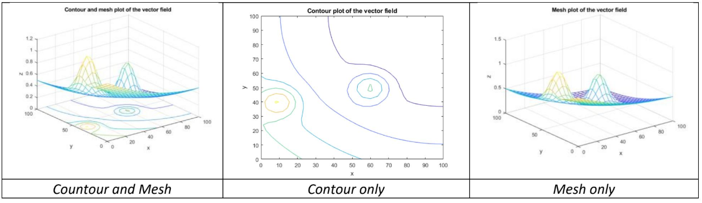
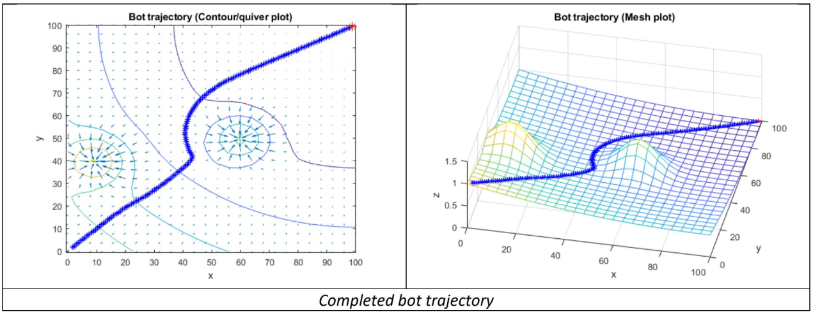
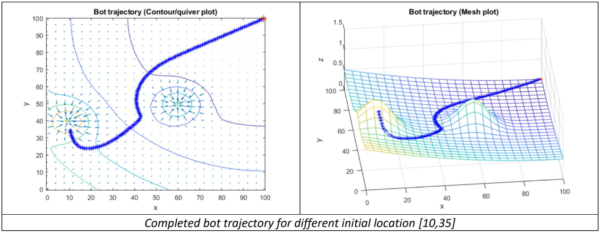
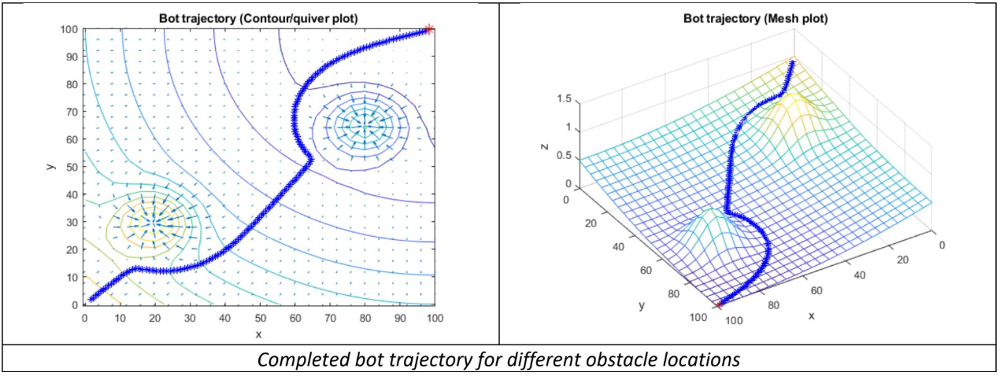

# Robot Traversal II

Visualizing Potential Field

- using contour, mesh, and quiver plots

Gradient Descent Algorithm

- Implemented gradient descent algorithm to navigate the potential field
- The gradient algorithm will model obstacles to avoid as local maximums while following the direction of the vector potential field lines E.
Which leads the bot from locations of higher potential to lower potential while avoiding sources—local maximums in the potential field. This will work as long as there are no local minimums that the robot will encounter on its path towards its goal.

  - x=x-α∇A(x)=x-αE

## Environment Modeling using Contour and Mesh

## Trajectory 1

## Trajectory 2 (Changing Initial Location)

## Trajectory 3 (Moving Obstacle Placement)

